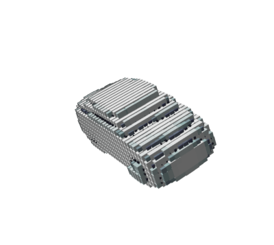
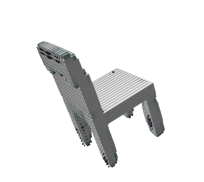
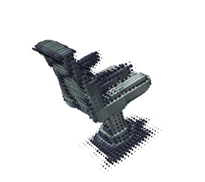
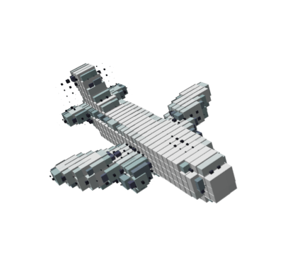
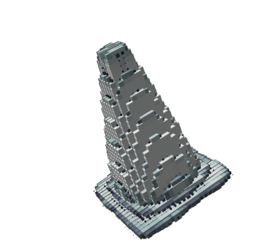
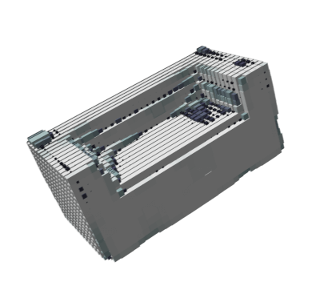
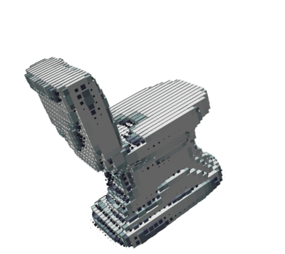
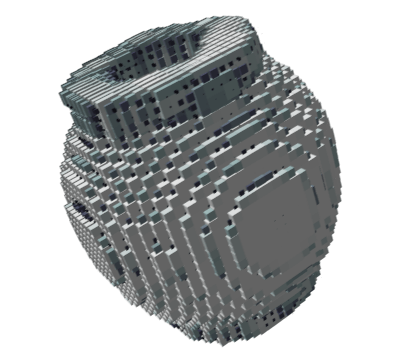

# Variational Shape Learner

This repository contains the source code to support the paper: [Learning a Hierarchical Latent-Variable Model of 3D Shapes](https://arxiv.org/abs/1705.05994), introduced by [Shikun Liu](http://shikun.io/), [C. Lee Giles](https://clgiles.ist.psu.edu/), [Alexander G. Ororbia II](http://www.personal.psu.edu/ago109/). 




For more visual results, please visit our project page [here](http://shikun.io/papers/vsl.html).

## Requirements
VSL was written in `python 3.6`. In order to run the code, please make sure the following packages have been installed.
- h5py 2.7
- matplotlib 1.5
- mayavi 4.5
- numpy 1.12
- scikit-learn 0.18
- tensorflow 1.0

Most of the above can be directly installed using the `pip` command. However, we recommend that `mayavi`, which is used for 3D voxel visualization, is installed using `conda` environment (for simplicity).

## Dataset
We use both 3D shapes from [ModelNet](http://modelnet.cs.princeton.edu/) and [PASCAL 3D+ v1.0](http://cvgl.stanford.edu/projects/pascal3d.html) aligned with images in [PASCAL VOC 2012](http://host.robots.ox.ac.uk/pascal/VOC/voc2012/index.html) for training our proposed VSL. ModelNet is used for general 3D shape learning including shape generation, interpolation and classification. PASCAL 3D is only used for image reconstruction.

Please download the dataset here: [[link]](https://www.dropbox.com/s/sk756qif5tfk9w3/dataset.zip?dl=0).

The above dataset contains files `ModelNet10_res30_raw.mat` and `ModelNet40_res30_raw.mat` representing the voxelized version of ModelNet10/40 and  `PASCAL3D.mat` which represents voxelized PASCAL3D+ aligned with images.

Each ModelNet dataset contains a `train` and `test` split with each entry having `270001` dimension representing `[id|voxel]` in `[30x30x30]` resolution.

PASCAL3D contains `image_train`, `model_train`, `image_test`, `model_test` which were defined in [Kar, et al](https://github.com/akar43/CategoryShapes). Each entry of `model` again has `270001` dimensions which is similar to that defined in ModelNet and each entry of `image` has `[100,100,3]` dimensions representing `[100x100]` RGB images.

## Parameters
We have also included the pre-trained model parameters, which can be downloaded [here](https://www.dropbox.com/s/pz5kqi8guq0jxgm/parameters.zip?dl=0).

## Training VSL
Please download `dataset` and `parameters` (if using pre-trained parameters) from the links in the previous sections and extract them in the same folder of this repository.

Please use `vsl_main.py` for general 3D shape learning experiments, and `vsl_imrec.py` for image reconstruction experiment. In order to correctly use the hyper-parameters of the pre-trained model and to be consistent with the other experiment settings in the paper, please define hyper-parameters as follows,

||ModelNet40 | ModelNet10 | PASCAL3D (jointly) | PASCAL3D (separately)|
|---|---|---|---|---|
`global_latent_dim` | 20 | 10|10|5|
`local_latent_dim` | 10 | 5|5|2|
`local_latent_num` | 5 | 5|5|3|
`batch_size` | 200 | 100 | 40 | 5|

The implementations are fully commented. For further details, please consult the paper and source code.

Normally, training VSL from scratch requires 40 hours on ModelNet on a fast computer, and requires 20-40 minutes on separately-trained image reconstruction experiment.


## Citation
If you found this code/work to be useful in your own research, please considering citing the following:

```
@article{liu2018learning,
  title={Learning a Hierarchical Latent-Variable Model of 3D Shapes},
  author={Liu, Shikun and Giles, C Lee，and Ororbia II, and Alexander, G},
  journal={International Conference on 3D Vision (3DV)},
  year={2018}
}
```

## Contact
If you have any questions, please contact `sk.lorenmt@gmail.com`.
